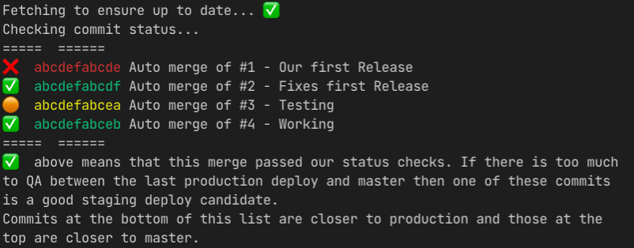

This repository contains two scripts to simplify some common QA git tasks, these are:

1. [script.sh](#scriptsh) - opens pull requests between two commit references
2. [qa-able-commits.sh](#qa-able-commitssh) - shows merge commits and ci-status checks between two commit references

To run either of these scripts you will need a local copy:

    git clone github.com/blunderdome/PR-opener.git
    cd PR_opener

## script.sh

This is a script that, given two commits in a repo, opens all the PRs in the diff in new tabs in your default browser.

### Instructions to open PRs

To run the script:

    ./script.sh [--markdown] from_commit to_commit base_url git_directory project_subdirectory

Example:

    ./script.sh origin/production origin/staging https://github.com/myusername/myproject/pull/ ~/Documents/programs/myproject tooling

Will open PRs that made changes to files in the `tooling/` directory of a project. The `project_subdirectory` parameter is optional, and if none is specified the script will look in the entire project rather than a specific subdirectory.

**Warning: running this script may open a lot of new tabs!**

If you set a `base_url` and a `git_directory`, the script will use those as defaults whenever they aren't specified. Example:

    export REPO_URL=https://github.com/myusername/myproject/pull/
    export LOCAL_REPO_PATH=/Users/myusername/Documents/programs/myproject/.git

You can also add these directly to your `bash_profile` (or whatever profile you use).

The `from_commit` and `to_commit` variables default to `origin/production` and `origin/staging`, respectively.

`--markdown` generates list of PRs and extra info in a markdown checklist and copies it to clipboard. This requires the [`hub`](https://github.com/github/hub) command to be installed and authenticated.

* If you run this script with `--markdown` and see messages like "Requires authentication" or "github.com username: github.com password..." then you may not be authenticated. Try running `hub browse` from a cloned local repo to authenticate. ([There is not currently a dedicated `hub` authentication command](https://github.com/github/hub/issues/225), so please note that running `browse` will open a browser window to your origin repo URL on GitHub.)

## qa-able-commits.sh

This is a script that, given merge commits in a repo, will list these commits along with a status showing whether they passed github ci status checks.

### Instructions to list QA able commits

To run the script:

    ./qa-able-commits.sh from_commit to_commit git_directory project_subdirectory log_match_pattern

Example:

    ./qa-able-commits.sh origin/production origin/staging ~/Documents/programs/myproject tooling "^Auto merge of #"

Will list merge commits matching the log pattern "Auto merge of #" in the tooling directory of a project. The `project_subdirectory` parameter is optional, and if non is specified the script will look in the entire project folder rather than changes within a specific subdirectory.

If you set a `git_directory` and `project_subdirectory` in your environment, the script will use those defaults whenever they aren't specified. Example:

    export LOCAL_REPO_PATH=/Users/myusername/Documents/programs/myproject
    export LOCAL_REPO_SUBDIRECTORY=project_subdirectory
    export LOCAL_REPO_MATCH_ON=log_match_pattern

You can also add these directly to your `bash_profile` (or whatever profile you use).

The `from_commit` and `to_commit` variables default to `origin/production` and `origin/staging`, respectively. Note these differ from the `script.sh` defaults.

* If you run this script and see messages like "Requires authentication" or "github.com username: github.com password..." then you may not be authenticated. Try running `hub browse` from a cloned local repo to authenticate. ([There is not currently a dedicated `hub` authentication command](https://github.com/github/hub/issues/225), so please note that running `browse` will open a browser window to your origin repo URL on GitHub.)
